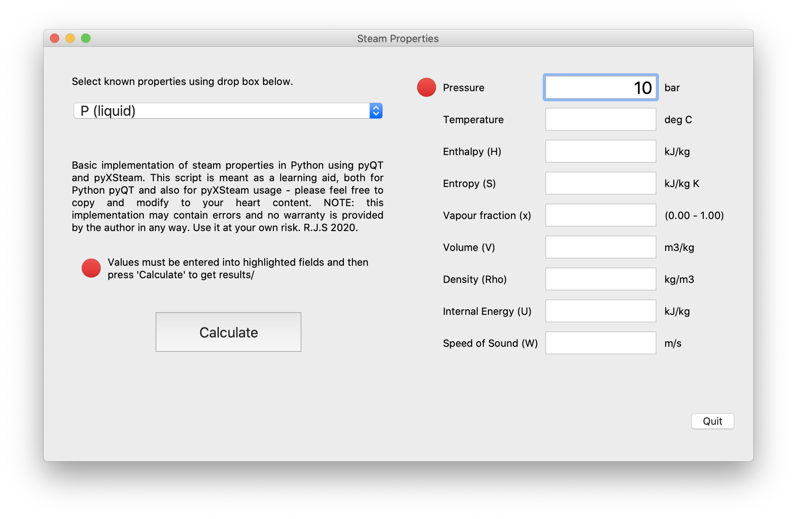

# steam-properties
pyQT code using pyXsteam to display steam properties

Calculate steam/water properties (enthalpy, entropy, volume, etc) using Python 3.

Please feel free to use/modify to your hearts content. The code is not the prettiest or the best and I in no way claim to be a programmer (It's just a hobby). If you think you can improve it, please go ahead.
